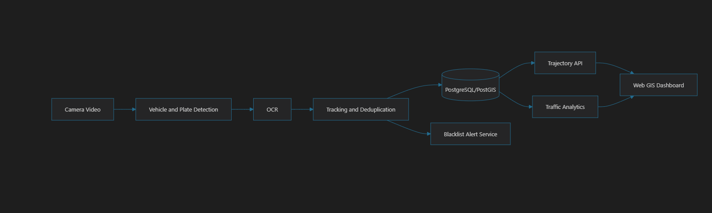

Build a small end-to-end system that:

Reads vehicle video or images.
Detects license plates.
Extracts plate text using OCR.
Tracks vehicles within and across cameras.
Stores plate sightings with time and location.
Displays a vehicle route on a map.
Shows basic traffic analytics and blacklist alerts.

 Prototype Stack

Backend: Python and FastAPI
Detection: YOLOv8 or YOLO11
OCR: PaddleOCR
Object tracking: ByteTrack or BoT-SORT
Database: PostgreSQL with PostGIS
Dashboard: React with Leaflet, or Streamlit for a faster prototype
Charts: Plotly
Optional message queue: Redis
Deployment: Docker Compose

Suggested Project Structure

SIH26127/
├── backend/
│   ├── main.py
│   ├── api/
│   │   ├── sightings.py
│   │   ├── trajectories.py
│   │   └── analytics.py
│   ├── services/
│   │   ├── detection.py
│   │   ├── ocr.py
│   │   ├── tracking.py
│   │   └── alerts.py
│   ├── models/
│   │   └── database.py
│   └── requirements.txt
├── dashboard/
├── data/
│   ├── videos/
│   ├── test_images/
│   └── cameras.json
├── models/
├── docker-compose.yml
└── README.md